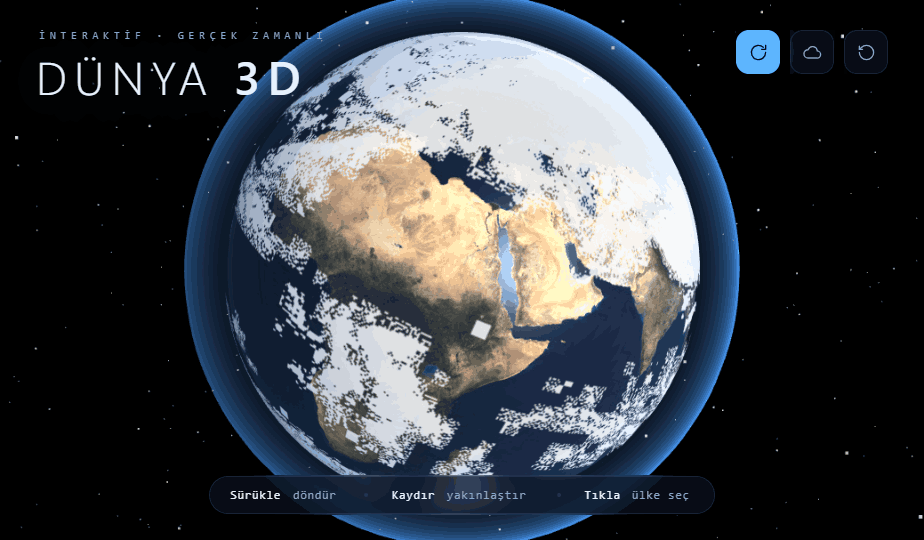

<div align="center">

# 🌍 3D Dünya Haritası · 3D World Map

**Interactive 3D Earth globe built with Three.js — day/night shader, clouds, atmosphere & clickable countries.**

*Three.js ile yapılmış interaktif 3 boyutlu dünya küresi — gündüz/gece shader'ı, bulutlar, atmosfer ve tıklanabilir ülkeler.*


[**English**](#english) · [**Türkçe**](#türkçe)



</div>

---

## English

### About

A single-page, fully interactive 3D model of the Earth rendered in the browser with [Three.js](https://threejs.org/). Spin the globe, zoom in, and click any landmass to reveal the nearest country, its coordinates, and an approximate local time. There is **no build step and nothing to install** — it's plain HTML, CSS, and JavaScript.

### Features

- 🌗 **Realistic day/night Earth** — a custom GLSL shader blends the daytime texture on the sunlit side with city-lights on the dark side, separated by a soft terminator (sunrise/sunset line).
- 🌊 **Ocean sun glint** — specular highlights shimmer across the seas based on a specular map.
- ☁️ **Animated cloud layer** that drifts slightly faster than the surface, and can be toggled on/off.
- 🌌 **Atmospheric glow** — a Fresnel rim shader gives the planet a soft blue halo, brighter on the day side.
- ✨ **Procedural starfield** — 4,200 stars with subtle color variation.
- 📍 **Click to explore** — click any landmass to drop an animated, pulsing marker and open an info card with the nearest country, latitude, longitude, and approximate local time.
- 🏷️ **Floating label** that tracks the marker and hides when it rotates to the far side of the globe.
- 🔄 **Auto-rotation** with a realistic 23.5° axial tilt; pauses automatically while you interact.
- 📱 **Fully responsive** with a clean, space-themed HUD.

### Tech stack

- **[Three.js](https://threejs.org/) 0.128.0** + `OrbitControls` (loaded from the jsDelivr CDN)
- **Vanilla JavaScript, HTML & CSS** — no framework, no bundler
- **Custom GLSL shaders** for the day/night surface and the atmosphere
- **Google Fonts:** Space Grotesk + IBM Plex Mono
- **Earth textures** from the Three.js examples (originally [NASA Visible Earth](https://visibleearth.nasa.gov/))

### Getting started

```bash
git clone https://github.com/alperenCiftcibasi/3d-globe-map.git
cd 3d-globe-map
```

**Option A — open directly:** double-click `3 Boyutlu Dünya Haritası.html` to open it in your browser.

**Option B — local server (recommended):** serving over `http://` avoids any `file://` quirks.

```bash
# with Python
python -m http.server 8000

# or with Node
npx serve
```

Then open <http://localhost:8000> and select the HTML file.

> **Note:** an internet connection is required on first load — Three.js, the OrbitControls add-on, and the planet textures are fetched from a CDN.

### Controls

| Action | Result |
| --- | --- |
| **Drag** | Rotate the globe |
| **Scroll / pinch** | Zoom in & out |
| **Click** a landmass | Select the nearest country |
| ↻ button | Toggle auto-rotation |
| ☁ button | Toggle clouds |
| ⟲ button | Reset the view |

### How it works

- **Scene graph:** an outer group applies the 23.5° axial tilt, an inner group handles the spin, and both the Earth and clouds live inside it.
- **Day/night surface:** a `ShaderMaterial` computes the dot product between the surface normal and the sun direction, then mixes the day texture (lit side) with the night-lights texture (dark side) using a `smoothstep` terminator. Ocean areas add a specular sun highlight.
- **Country detection:** clicks are ray-cast onto the sphere and converted to latitude/longitude. The app then finds the nearest of **136 country centroids** (`countries.js`) using a latitude-weighted distance. If the click is too far from any centroid, it's labeled *open sea*.
- **Local time** is approximated from the longitude (`UTC offset ≈ longitude / 15`).

> ℹ️ Country results are **approximate** — they snap to the closest country center, not exact borders.

### Project structure

```
.
├── 3 Boyutlu Dünya Haritası.html   # Markup + all styling (space-themed HUD)
├── globe.js                        # Three.js scene, shaders & interaction logic
├── countries.js                    # 136 country centroids { name, lat, lon }
├── screenshots/                    # Preview images
└── .thumbnail                      # WebP preview
```

### Credits

- 3D rendering by **[Three.js](https://threejs.org/)** (Ricardo Cabello / mrdoob and contributors)
- Earth day, night-lights, specular & cloud textures from the Three.js examples — based on **[NASA Visible Earth](https://visibleearth.nasa.gov/)**

### License

Released under the **MIT License** — see [`LICENSE`](LICENSE) for details. The bundled Earth textures originate from the Three.js examples ([NASA Visible Earth](https://visibleearth.nasa.gov/), public domain).

---

## Türkçe

### Hakkında

Tarayıcıda [Three.js](https://threejs.org/) ile çizilen, tek sayfalık ve tamamen interaktif bir 3 boyutlu Dünya modeli. Küreyi döndürebilir, yakınlaştırabilir ve herhangi bir kara parçasına tıklayarak en yakın ülkeyi, koordinatlarını ve yaklaşık yerel saati görebilirsiniz. **Derleme adımı veya kurulum gerektirmez** — yalnızca düz HTML, CSS ve JavaScript'tir.

### Özellikler

- 🌗 **Gerçekçi gündüz/gece** — özel bir GLSL shader, güneş gören tarafta gündüz dokusunu, karanlık tarafta şehir ışıklarını yumuşak bir *terminatör* (gündoğumu/günbatımı çizgisi) ile harmanlar.
- 🌊 **Okyanus parıltısı** — specular haritaya göre denizlerde güneş yansımaları parıldar.
- ☁️ **Hareketli bulut katmanı** — yüzeyden biraz daha hızlı süzülür, açılıp kapatılabilir.
- 🌌 **Atmosfer parıltısı** — Fresnel tabanlı bir shader, gezegene gündüz tarafında daha parlak yumuşak mavi bir hale verir.
- ✨ **Prosedürel yıldız alanı** — hafif renk çeşitliliğine sahip 4.200 yıldız.
- 📍 **Tıkla ve keşfet** — bir kara parçasına tıkladığında nabız gibi atan animasyonlu bir işaretçi düşer ve en yakın ülkeyi, enlem/boylamı ve yaklaşık yerel saati gösteren bir bilgi kartı açılır.
- 🏷️ **Yüzen etiket** işaretçiyi takip eder ve kürenin arka yüzüne döndüğünde gizlenir.
- 🔄 **Otomatik dönüş** gerçekçi 23,5° eksen eğikliğiyle çalışır; etkileşim sırasında otomatik olarak duraklar.
- 📱 **Tamamen duyarlı (responsive)** ve sade, uzay temalı bir arayüze sahiptir.

### Kullanılan teknolojiler

- **[Three.js](https://threejs.org/) 0.128.0** + `OrbitControls` (jsDelivr CDN üzerinden)
- **Saf JavaScript, HTML ve CSS** — framework yok, paketleyici yok
- Gündüz/gece yüzeyi ve atmosfer için **özel GLSL shader'lar**
- **Google Fonts:** Space Grotesk + IBM Plex Mono
- **Dünya dokuları** Three.js örneklerinden (kaynak: [NASA Visible Earth](https://visibleearth.nasa.gov/))

### Başlarken

```bash
git clone https://github.com/alperenCiftcibasi/3d-globe-map.git
cd 3d-globe-map
```

**Seçenek A — doğrudan açma:** `3 Boyutlu Dünya Haritası.html` dosyasına çift tıklayarak tarayıcıda açın.

**Seçenek B — yerel sunucu (önerilir):** `http://` üzerinden sunmak `file://` kaynaklı olası sorunları önler.

```bash
# Python ile
python -m http.server 8000

# veya Node ile
npx serve
```

Ardından <http://localhost:8000> adresini açıp HTML dosyasını seçin.

> **Not:** İlk açılışta internet bağlantısı gerekir — Three.js, OrbitControls eklentisi ve gezegen dokuları bir CDN'den indirilir.

### Kontroller

| Eylem | Sonuç |
| --- | --- |
| **Sürükle** | Küreyi döndür |
| **Kaydır / pinch** | Yakınlaştır & uzaklaştır |
| Kara parçasına **tıkla** | En yakın ülkeyi seç |
| ↻ butonu | Otomatik dönüşü aç/kapat |
| ☁ butonu | Bulutları aç/kapat |
| ⟲ butonu | Görünümü sıfırla |

### Nasıl çalışır?

- **Sahne hiyerarşisi:** dış grup 23,5° eksen eğikliğini uygular, iç grup dönüşü yönetir; Dünya ve bulutlar bu grubun içinde yer alır.
- **Gündüz/gece yüzeyi:** bir `ShaderMaterial`, yüzey normali ile güneş yönü arasındaki nokta çarpımını hesaplar; ardından gündüz dokusunu (aydınlık taraf) ve gece ışıkları dokusunu (karanlık taraf) bir `smoothstep` terminatörüyle harmanlar. Okyanus bölgeleri specular bir güneş yansıması ekler.
- **Ülke tespiti:** tıklamalar küreye ray ile yansıtılır ve enlem/boylama çevrilir. Uygulama, enlem-ağırlıklı bir mesafe kullanarak **136 ülke merkezinden** (`countries.js`) en yakınını bulur. Tıklama herhangi bir merkeze çok uzaksa *Açık Deniz* olarak etiketlenir.
- **Yerel saat**, boylamdan yaklaşık olarak hesaplanır (`UTC ofseti ≈ boylam / 15`).

> ℹ️ Ülke sonuçları **yaklaşıktır** — kesin sınırlara değil, en yakın ülke merkezine yuvarlanır.

### Proje yapısı

```
.
├── 3 Boyutlu Dünya Haritası.html   # İşaretleme + tüm stiller (uzay temalı arayüz)
├── globe.js                        # Three.js sahnesi, shader'lar & etkileşim mantığı
├── countries.js                    # 136 ülke merkezi { name, lat, lon }
├── screenshots/                    # Önizleme görselleri
└── .thumbnail                      # WebP önizleme
```

### Teşekkürler

- 3D çizim **[Three.js](https://threejs.org/)** ile (Ricardo Cabello / mrdoob ve katkıda bulunanlar)
- Dünya gündüz, gece ışıkları, specular & bulut dokuları Three.js örneklerinden — kaynak: **[NASA Visible Earth](https://visibleearth.nasa.gov/)**

### Lisans

**MIT Lisansı** ile yayınlanmıştır — ayrıntılar için [`LICENSE`](LICENSE) dosyasına bakın. Projeyle gelen Dünya dokuları Three.js örneklerinden gelir ([NASA Visible Earth](https://visibleearth.nasa.gov/), kamu malı).
